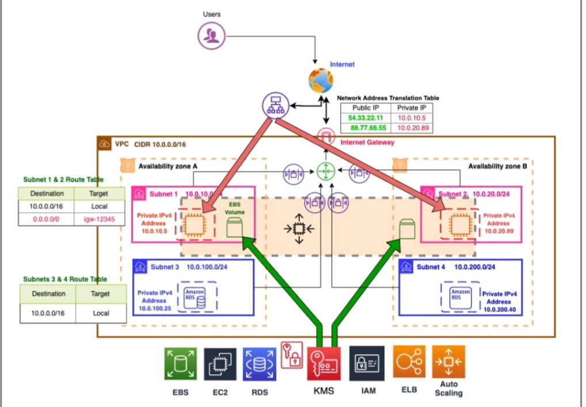
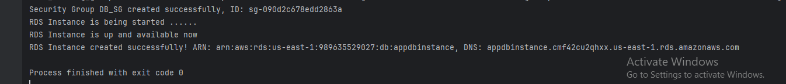
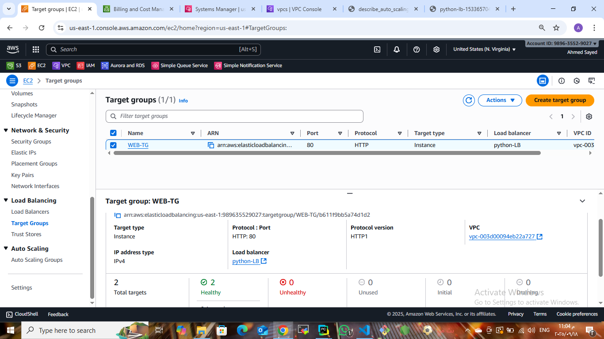
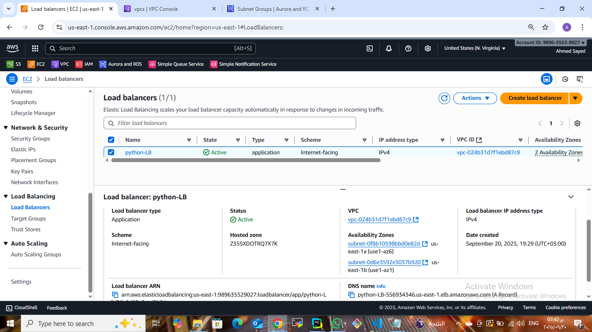
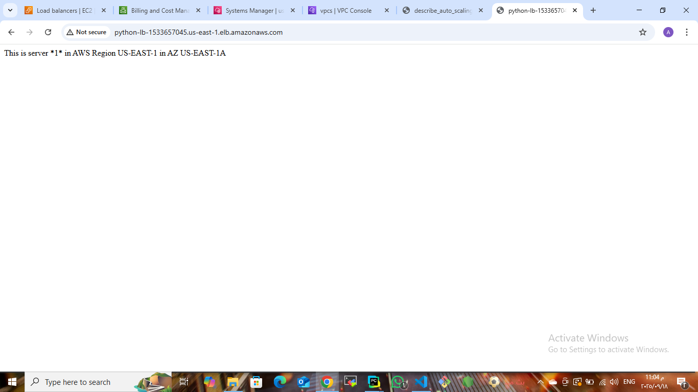
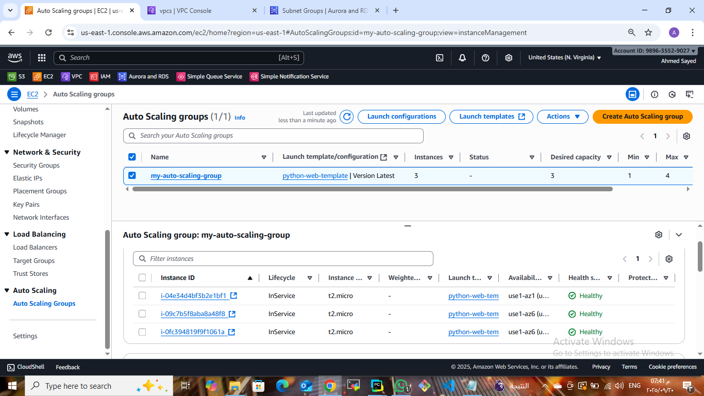
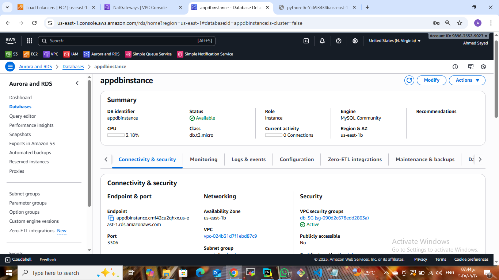

# 🌐 AWS Auto Scaling Web Application using python(boto3)

This project demonstrates deploying a highly available and scalable web application on AWS using Python (Boto3) automation.  
The infrastructure includes VPC, Subnets, EC2 Instances, Application Load Balancer (ALB), Target Group (TG), Auto Scaling Group (ASG), and RDS Database.  
All steps are validated with screenshots for clarity.

---

## 🖼 Project Architecture

The following diagram shows the overall infrastructure:



---

## 📁 Project Structure

.
├── code/  
│   ├── project.py  
├── screenshots/  
│   ├── 01-code-output.png
│   ├── 02-rds-code-output.png  
│   ├── 03-web-TG.png  
│   ├── 04-ALB.png  
│   ├── 05-browser-first-check.png  
│   ├── 06-browser-second-check.png  
│   ├── 07-ASG.png  
│   ├── 08-rds-subnet-group
│   ├── 09-RDS.png  
├── Architecture.jpg  
├── README.md  

---

## ⚙ Code Execution

The automation is done using Python with Boto3 to create the AWS resources.  
When executed, the script provisions all required infrastructure.




---

## 🎯 Target Group

The Target Group is created and successfully registers backend EC2 instances with healthy status.



---

## 🌍 Application Load Balancer

The ALB is created and used to distribute traffic across instances for high availability.



---

## 🖥 Browser Checks

After deployment, the ALB DNS is tested from the browser.  
Each refresh serves traffic from a different backend instance:

- First server response  
  

- Second server response  
  

---

## 📈 Auto Scaling Group

The Auto Scaling Group (ASG) manages scaling by automatically launching and terminating EC2 instances based on demand.  
This ensures resilience and fault tolerance.



---

## 📈 Auto Scaling Explained

Auto Scaling is one of the core features of AWS for elasticity and availability:  

- 🟢 High Availability → if an instance fails, the ASG replaces it automatically.  
- 🟢 Scalability → capacity can increase or decrease dynamically based on CloudWatch metrics.  
- 🟢 Fault Tolerance → workloads remain available even during unexpected traffic spikes.  

In this project:  
- The ASG maintains a minimum number of healthy instances.  
- New instances are automatically registered with the Target Group and served by the Load Balancer.  

---

## 🗄 Amazon RDS (Database Layer)

As part of the infrastructure, an Amazon RDS instance is also provisioned using the Python script:  

- 💾 Provides a managed relational database (e.g., MySQL/PostgreSQL).  
- 🔒 Keeps the database layer separate from the web servers, improving security and isolation.  
- 📊 Enhances scalability as the app can grow horizontally on the web tier while sharing a centralized DB.  



👉 Note:  
- Make sure to update DB credentials and parameters in the script before deploying.  
- Ensure the RDS Security Group allows access only from the web servers or a bastion host.  
- Don’t forget to delete the RDS instance during cleanup to avoid extra costs.  

---

## 🚀 Steps to Run

1. Clone the repository  
   ```bash
   git clone https://github.com/your-username/aws-autoscaling-app.git
   cd aws-autoscaling-app
   

2. *Configure AWS credentials*  
   bash
   aws configure
   

3. *Run the Python script*  
   bash
   python3 code/main.py
   

4. *Verify resources* in the AWS Management Console:  
   - ✅ Target Group (healthy instances)  
   - ✅ Application Load Balancer (active)  
   - ✅ Auto Scaling Group (launched instances)  
   - ✅ RDS Database (created and available)  
   - ✅ Browser responses switching between servers  

---

## 📌 Notes

- Tested on AWS Free Tier account.  
- Clean up resources after testing to avoid charges.  
- IAM role requires permissions for *EC2, ELB, Auto Scaling, VPC, and RDS*.  

---

## 👤 Author

Ahmed Sayed  
[LinkedIn](https://www.linkedin.com/in/ahmed-sayed-devops-cloud)  
[GitHub](https://github.com/ahmed-sayed-devops)

---

## 📜 License

This project is licensed under the MIT License - see the [LICENSE](LICENSE) file for details.